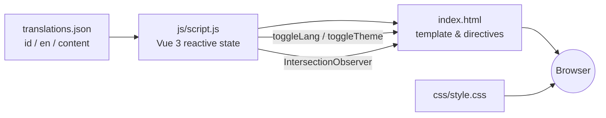

<div align="center">


<h1>Aslam Rizky Fadillah</h1>

<a href="https://readme-typing-svg.demolab.com">
  
</a>

<br/>

[](#)
[](#)
[](#)
[](#)
[](#)

<sub>🇮🇩 Bahasa Indonesia • klik bagian di bawah untuk versi 🇬🇧 <a href="#-english-version">English</a></sub>

</div>

---

### 📌 Daftar Isi

<details open>
<summary>Klik untuk buka/tutup</summary>

- [📖 Tentang](#-tentang)
- [✨ Fitur](#-fitur)
- [🧩 Arsitektur](#-arsitektur)
- [🛠️ Tech Stack](#️-tech-stack)
- [📁 Struktur Folder](#-struktur-folder)
- [🚀 Menjalankan Secara Lokal](#-menjalankan-secara-lokal)
- [⚙️ Kustomisasi Konten](#️-kustomisasi-konten)
- [🗺️ Peta Section](#️-peta-section)
- [🧭 Roadmap](#-roadmap)
- [📬 Kontak](#-kontak)
- [🌐 English Version](#-english-version)

</details>

---

## 📖 Tentang

Situs portofolio pribadi milik **Aslam Rizky Fadillah** — dibangun dari nol dengan **HTML, CSS, dan Vue 3 (via CDN)** tanpa build tool sama sekali. Ringan, cepat, dan bisa langsung di-deploy di mana pun (GitHub Pages, Netlify, Vercel, dsb).

Berisi profil singkat, statistik akademik, pengalaman organisasi, showcase proyek, tumpukan teknologi, dan sertifikat yang pernah diraih — dibungkus dalam nuansa dark futuristik dengan aksen *neon-blue*.

> 💡 **Tanpa `npm install`, tanpa bundler.** Buka `index.html`, dan situs langsung berjalan penuh.

## ✨ Fitur

<table>
<tr>
<td width="50%" valign="top">

**Pengalaman & Interaksi**
- 🎨 Desain dark futuristik + aksen neon-blue & particle background
- 🌗 Dark / Light mode toggle
- 🌐 Dwibahasa (ID/EN) — teks berubah real-time
- 🖱️ Custom cursor interaktif (dot + ring mengikuti mouse)
- 🧭 Navbar *floating capsule* dengan scrollspy otomatis
- 🪄 Scroll-reveal animation (`IntersectionObserver`)

</td>
<td width="50%" valign="top">

**Konten & Data**
- 🗂️ Tab interaktif untuk Projects & Sertifikat
- 🔁 Tech Stack marquee — baris auto-scroll arah berlawanan
- 📊 Statistik ringkas (semester, proyek, tech stack, organisasi, sertifikat, pengalaman)
- 🖼️ Drawer detail proyek & lightbox sertifikat
- 📩 Form kontak → langsung buka `mailto:`
- 📱 Fully responsive (mobile → desktop)

</td>
</tr>
</table>

## 🧩 Arsitektur

Alur data satu arah: seluruh konten disimpan sebagai data di `translations.json` & `js/script.js`, lalu dirender reaktif oleh Vue ke `index.html`.



<details>
<summary>🔍 Penjelasan singkat tiap layer</summary>

| Layer | Peran |
|---|---|
| `translations.json` | Sumber tunggal seluruh teks (ID/EN) & konten dinamis (proyek, tech stack, sertifikat, pengalaman) |
| `js/script.js` | State management (Composition API), computed properties, efek interaktif (particle bg, marquee, scrollspy) |
| `index.html` | Markup + binding Vue (`v-for`, `v-if`, `:class`, `@click`) |
| `css/style.css` | Seluruh styling, tema, animasi, dan efek visual |

</details>

## 🛠️ Tech Stack

| Kategori | Teknologi |
|---|---|
| Markup & Styling | HTML5, CSS3 (custom properties, grid, glassmorphism) |
| Interaktivitas | [Vue 3](https://vuejs.org/) — Composition API, via CDN (no build step) |
| Ikon | [Devicon](https://devicon.dev/) |
| Font | Inter, JetBrains Mono (Google Fonts) |

## 📁 Struktur Folder

```
portofolio/
├── index.html            # Struktur & seluruh markup halaman
├── translations.json     # Teks ID/EN + seluruh konten dinamis (proyek, tech stack, dll.)
├── css/
│   └── style.css         # Styling, tema, dan animasi
├── js/
│   └── script.js         # Logic Vue: state, computed, interaksi
├── img/                  # Foto profil, gambar proyek, sertifikat
└── README.md
```

## 🚀 Menjalankan Secara Lokal

<details open>
<summary><b>Opsi 1 — Buka langsung</b></summary>

```bash
git clone https://github.com/aslamrizky/portofolio.git
cd portofolio

open index.html      # macOS
start index.html      # Windows
xdg-open index.html   # Linux
```
</details>

<details>
<summary><b>Opsi 2 — Local server (disarankan)</b></summary>

```bash
npx serve .
# atau
python3 -m http.server 8080
```
Lalu buka `http://localhost:8080` di browser.
</details>

## ⚙️ Kustomisasi Konten

Semua teks dan konten dinamis (proyek, tech stack, sertifikat, pengalaman, statistik) dikelola di **`translations.json`**, jadi menambah/mengubah konten tidak perlu menyentuh HTML sama sekali.

<details>
<summary>Contoh: menambah item Tech Stack</summary>

```json
"techStack": [
  { "name": "HTML5", "icon": "devicon-html5-plain colored" },
  { "name": "CSS3",  "icon": "devicon-css3-plain colored" }
]
```
</details>

<details>
<summary>Contoh: menambah teks dwibahasa baru</summary>

```json
"id": { "stats": { "exp": "Pengalaman" } },
"en": { "stats": { "exp": "Experience" } }
```
</details>

## 🗺️ Peta Section

| Section | Isi |
|---|---|
| `#home` | Hero, perkenalan singkat, statistik & tech stack |
| `#about` | Bio, pendidikan, core & soft skills |
| `#experience` | Timeline pengalaman organisasi/kerja |
| `#portfolio` | Showcase proyek & sertifikat (tab) |
| `#contact` | Form kontak (mailto) & sosial media |

## 🧭 Roadmap

- [x] Dark/Light mode
- [x] Dwibahasa ID/EN
- [x] Floating capsule navbar

## 📬 Kontak

<p align="left">
<a href="https://github.com/aslamrizky"></a>
<a href="https://instagram.com/aslam.rizky04"></a>
<a href="mailto:aslamrizky81@gmail.com"></a>
</p>

---

## 🌐 English Version

<details>
<summary>Click to expand</summary>

### About
Personal portfolio site for **Aslam Rizky Fadillah**, built from scratch with **HTML, CSS, and Vue 3 (via CDN)** — zero build tools, so it's lightweight and deployable anywhere.

### Features
- Dark futuristic design with neon-blue accents & particle background
- Dark/Light mode toggle
- Bilingual (ID/EN), switches in real time
- Custom animated cursor
- Floating capsule navbar with scrollspy
- Scroll-reveal animations
- Interactive Projects/Certificates tabs
- Auto-scrolling tech stack marquee
- Project detail drawer & certificate lightbox
- Contact form via `mailto:`
- Fully responsive

### Run locally
```bash
git clone https://github.com/aslamrizky/portofolio.git
cd portofolio
python3 -m http.server 8080
```
Then open `http://localhost:8080`.

### Customization
All text and dynamic content (projects, tech stack, certificates, experience, stats) live in **`translations.json`** — no HTML editing required to update content.

</details>

---

<div align="center">
<sub>Dibuat dengan 💙 oleh <b>Aslam Rizky Fadillah</b></sub>
</div>